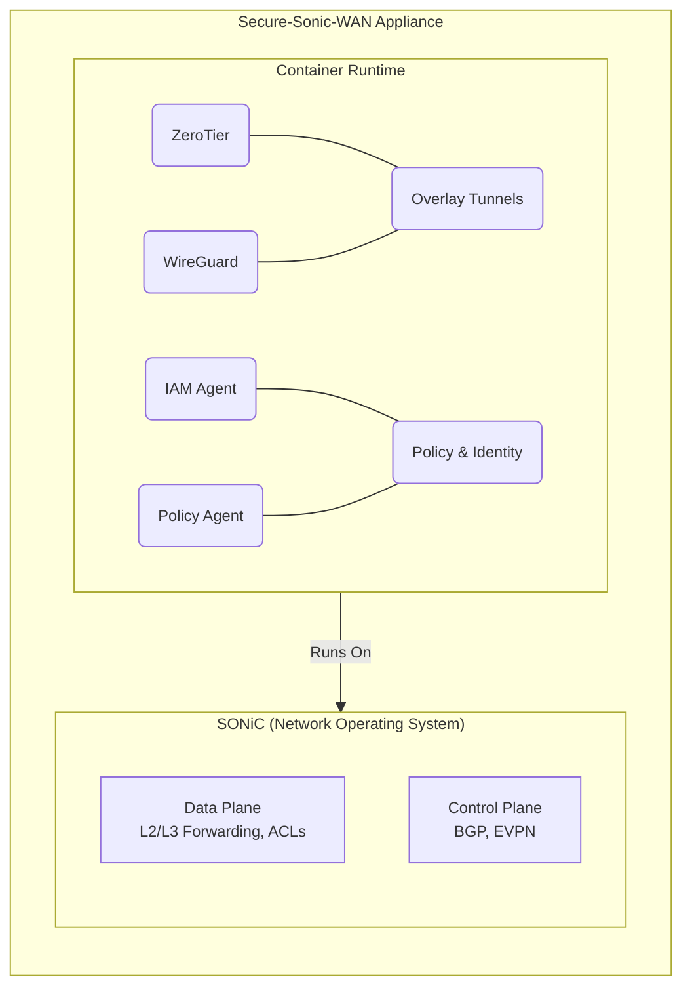
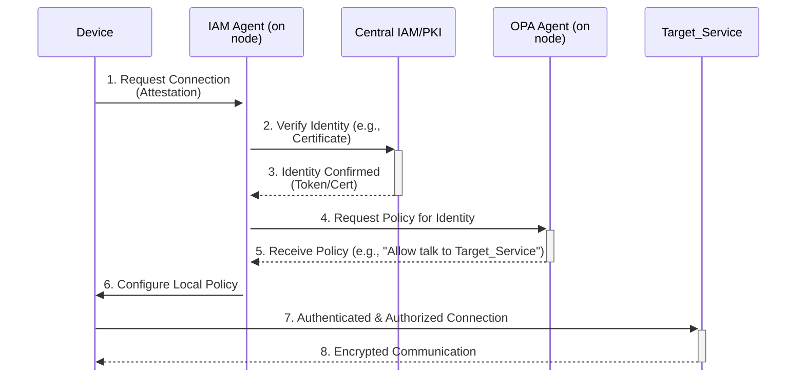
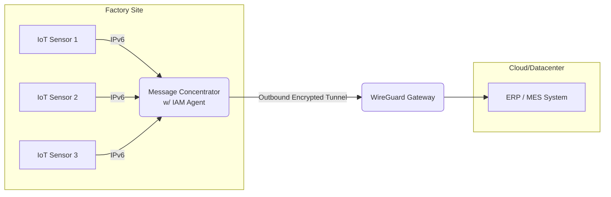
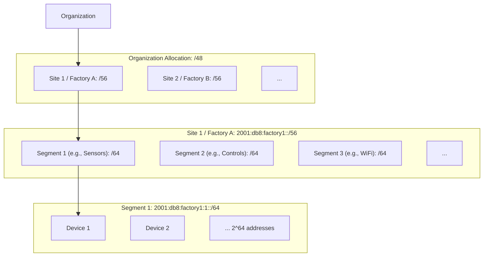
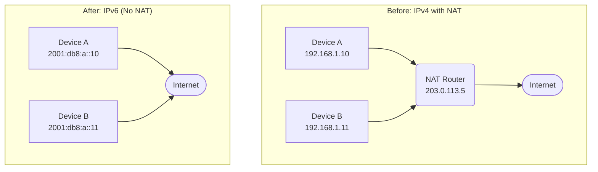
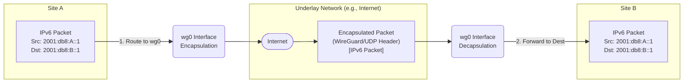
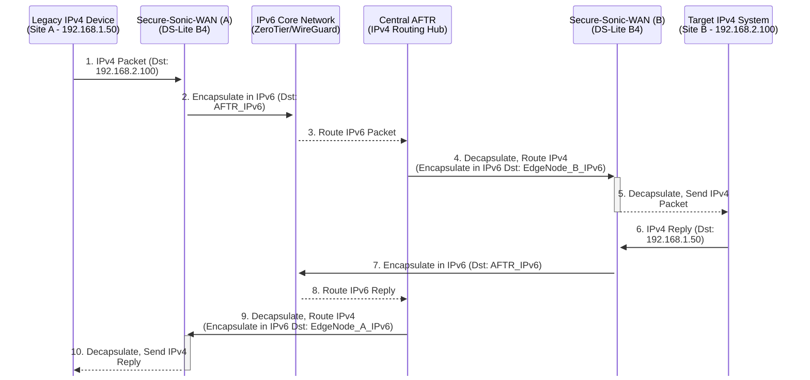

---
export_on_save:
  puppeteer: false
puppeteer:
  format: A4
  margin:
    top: 2cm
    bottom: 2cm
    left: 2cm
    right: 2cm
---

# Secure-Sonic-WAN: A Modern Zero-Trust IPv6 Architecture for Secure Edge Connectivity

## About This Document

This document has been prepared by Net-Innovate Solutions GmbH as a technical concept paper describing a Proof of Concept (POC) for a secure Wide Area Network architecture based on SONiC (Software for Open Networking in the Cloud). It is intended to serve as a foundation for discussions with interested stakeholders, including technology providers, open-source software developers, system integrators, and potential clients. The concepts presented herein represent Net-Innovate Solutions GmbH's vision for next-generation secure networking and are offered to facilitate collaboration and exploration of implementation opportunities.

**Copyright © 2025 Net-Innovate Solutions GmbH. All Rights Reserved.**

This document and its contents are proprietary and confidential. No part of this document may be reproduced, distributed, or transmitted in any form or by any means without the prior written permission of Net-Innovate Solutions GmbH.

**License:** Proprietary - Restricted Distribution

**Contact:** [office@net-innovate.com](mailto:office@net-innovate.com)

**Document Status:** Discussion Paper | **Version:** 1.0 | **Date:** October 2025

---

## 1\. Executive Summary

The Secure-Sonic-WAN project represents a next-generation approach to building secure, flexible, and cost-effective Wide Area Network (WAN) infrastructures. It leverages open-source networking software, IPv6-native design, and Zero Trust principles to provide a scalable, identity-driven networking architecture. The system is built around SONIC (Software for Open Networking in the Cloud) as the foundational network operating system, extended by containerized services for tunneling, identity, and policy management.

---

## 2\. Background and Motivation

Traditional enterprise WAN architectures rely heavily on static IPv4 networks, VLAN-based segmentation, and perimeter-based firewalls. These legacy designs are not well-suited to modern, distributed IT environments where users, devices, and applications are spread across many locations and clouds. IPv4-based networks are inherently limited by address space, rely on NAT, and lack native end-to-end security and mobility support.

Secure-Sonic-WAN aims to solve these issues by combining an IPv6-native underlay, Zero Trust networking (ZTN) principles, and open-source building blocks to create a distributed network that is secure by design ("security architected-in"), scalable to thousands of sites, and flexible enough for multi-cloud and IoT use cases.

-----

## 3\. Architecture Overview

At the core of the architecture is a SONIC-based virtual or physical network appliance that serves as the data plane and routing fabric. Instead of modifying SONIC directly, new functionality is added via containerized sidecars running directly on the SONIC host. These containers provide tunneling, identity, and policy enforcement capabilities.

The design follows a modular principle: SONIC handles switching, routing, and ACLs; containers handle overlay networking (ZeroTier, WireGuard), identity (IAM agent), and policy enforcement (OPA-based). This ensures clean separation of concerns, high maintainability, and ease of automation.

-----

## 4\. Key Architectural Principles

  * **IPv6 Everywhere**: Every device and network segment operates natively with IPv6, eliminating the need for NAT and simplifying global addressing.
  * **Zero Trust Networking**: No implicit trust. All communications are authenticated, authorized, and encrypted. Traffic is always initiated outbound.
  * **Identity-Centric Networking**: Devices and users are identified through IAM systems using certificates or tokens, replacing static IP or VLAN-based policies.
  * **Open Source and Hardware Independence**: All components are built from open-source software and run on commodity "white box" hardware or virtual machines.
  * **Automation and Observability**: Infrastructure as Code and telemetry are integral. All policies, configurations, and certificates are managed automatically.

-----

## 5\. Core Components

  * **SONIC Network Operating System** - Open-source switch and router platform providing L2/L3 forwarding, ACLs, and routing protocols such as BGP and EVPN.
  * **ZeroTier Container** - Provides dynamic overlay connectivity for site-to-site and edge-to-cloud communication with minimal configuration.
  * **WireGuard Container** - Offers encrypted tunnels for secure internet or SASE connectivity.
  * **IAM Agent** - Handles device identity, certificate management, and integration with a central IAM or PKI system (e.g., Keycloak, SPIRE, HashiCorp Vault).
  * **Policy Enforcement Agent** - Enforces routing and access policies locally using Open Policy Agent (OPA) rules.
  * **Telemetry and Logging** - Integrated observability via open-source stacks such as Prometheus, Grafana, and ELK.

-----

## 6\. IPv6-First Networking Model

The IPv6-based design provides each device with a globally unique address, removing the complexity of NAT and overlapping subnets. End-to-end connectivity is restored, enabling direct device-to-service communication while still being protected through Zero Trust enforcement.

With IPv6, each network segment (formerly VLAN) is represented by a /64 subnet. Routing and segmentation are handled logically based on identity and policy, not by static VLANs or IP ranges. This allows networks to scale to thousands of sites and millions of devices without complex address planning.

-----

## 7\. Zero Trust and Identity-Based Security

The Zero Trust principle of "never trust, always verify" is embedded at every layer. All devices, users, and applications authenticate through an Identity and Access Management (IAM) system before being granted access. Policies are based on verified identity, device posture, and context—not on network location.

Instead of perimeter firewalls, each edge node enforces micro-segmentation policies locally. Outbound-only tunnel connections (e.g., via WireGuard or ZeroTier) ensure that no inbound traffic is accepted unless explicitly authorized. This drastically reduces the attack surface and prevents lateral movement.

-----

## 8\. Industrial and IoT Use Cases

### a) Factory IoT Scenario

In a modern factory, hundreds of IoT sensors connect via WiFi and transmit operational data to a local message concentrator. The concentrator preprocesses data and securely forwards it to a central ERP/MES system through a WireGuard tunnel. Each sensor and concentrator authenticates via IAM, receives a certificate, and is assigned an IPv6 address. Zero Trust policies ensure sensors can only communicate with their local concentrator and IAM endpoints—nowhere else.

### b) Renewable Energy Park Scenario

In a distributed wind or solar park, each turbine or inverter sends telemetry data to a central controller. Each device connects over IPv6 and establishes an outbound-encrypted session to the site concentrator. From there, traffic is aggregated and securely tunneled to the cloud-based energy management system via ZeroTier or WireGuard. Identity-based policies prevent compromised devices from affecting others and allow fine-grained control of command distribution.

-----

## 9\. Advantages over Legacy IPv4/VLAN Architectures

* **Elimination of NAT and overlapping networks** simplifies connectivity and management.
* * **Identity replaces IP or VLAN** as the basis for policy, enabling true micro-segmentation.
* **Outbound-only encrypted communication** minimizes exposure to external attacks.
* **Horizontal scalability** makes it easy to add sites and devices without renumbering.
* **Vendor neutrality** thanks to a full stack built from open-source software, deployable on white-label uCPEs.
* **Built-in automation and observability** reduces operational complexity.

-----

## 10\. Open Source and White-Label Hardware Strategy

Secure-Sonic-WAN embraces open standards and open-source components to ensure transparency, flexibility, and cost-efficiency. It runs on commercial off-the-shelf (COTS) or white-label uCPE devices using x86 or ARM architectures, allowing enterprises to avoid vendor lock-in.

All major building blocks—SONIC, WireGuard, ZeroTier, OPA, and Keycloak—are open source and community-driven. This openness not only lowers total cost of ownership but also enables continuous innovation and security audits from the community. Organizations can integrate their own orchestration, monitoring, or automation frameworks without restrictions.

-----

## 11\. Implementation and Deployment Model

The system can be deployed as a virtual appliance, a containerized node within Containerlab for testing, or as a physical uCPE at the network edge. Automation scripts handle onboarding, identity registration, and policy synchronization with the central IAM system. For large-scale deployments, policies and configurations are managed centrally through Infrastructure-as-Code frameworks such as Ansible or Terraform, while local nodes enforce rules autonomously using cached policies for resilience.

-----

## 12\. Future Enhancements

Future iterations will integrate enhanced telemetry and AI-driven threat detection, support for post-quantum cryptography, and deeper integration with cloud-native IAM systems. Support for segment routing over IPv6 (SRv6) and automated service mesh integration are also planned to further streamline large-scale deployments.

-----

## 13\. Conclusion

Secure-Sonic-WAN defines a new paradigm for secure, scalable, and flexible WAN connectivity. It replaces static, perimeter-based architectures with an identity-driven, Zero Trust design that is inherently secure and adaptable to modern workloads. By leveraging IPv6, open-source software, and commodity hardware, it provides enterprises and operators with a future-proof solution that combines low cost, high performance, and uncompromising security—truly "architected-in" from the start.

-----

-----

## Appendix A: Open Source Projects Used in Secure-Sonic-WAN

This appendix lists the key open-source software components mentioned in the Secure-Sonic-WAN concept.

* **SONiC (Software for Open Networking in the Cloud)**
    * **Description:** An open-source network operating system (NOS) based on Linux that runs on switches and routers from multiple vendors. It provides L2/L3 forwarding, ACLs, and routing protocols.
    * **URL:** [https://sonicfoundation.dev/](https://sonicfoundation.dev/)
* **ZeroTier**
    * **Description:** A software solution providing dynamic overlay connectivity for site-to-site and edge-to-cloud communication, often used to create secure virtual networks across disparate physical networks.
    * **URL:** [https://www.zerotier.com/](https://www.zerotier.com/)
* **WireGuard**
    * **Description:** A fast, modern, and secure VPN tunnel utilizing state-of-the-art cryptography. Often used for secure internet access or connections to SASE (Secure Access Service Edge) providers.
    * **URL:** [https://www.wireguard.com/](https://www.wireguard.com/)
* **Open Policy Agent (OPA)**
    * **Description:** A general-purpose policy engine that allows you to define and enforce policies as code across various systems. Used locally on the edge node to enforce routing and access rules.
    * **URL:** [https://www.openpolicyagent.org/](https://www.openpolicyagent.org/)
* **Keycloak** (Example IAM System)
    * **Description:** An open-source Identity and Access Management (IAM) solution used for handling device identity, authentication, and authorization.
    * **URL:** [https://www.keycloak.org/](https://www.keycloak.org/)
* **SPIRE** (Example IAM/PKI System)
    * **Description:** A production-ready implementation of the SPIFFE specification, providing a toolchain for establishing trust between software systems. Mentioned as an example alternative for identity management.
    * **URL:** [https://spiffe.io/](https://spiffe.io/)
* **HashiCorp Vault** (Example IAM/PKI System)
    * **Description:** A tool for secrets management, identity-based access, and encrypting application data. Mentioned as an example alternative for identity and certificate management.
    * **URL:** [https://www.vaultproject.io/](https://www.vaultproject.io/)
* **Prometheus**
    * **Description:** An open-source systems monitoring and alerting toolkit, often used for collecting metrics.
    * **URL:** [https://prometheus.io/](https://prometheus.io/)
* **Grafana**
    * **Description:** An open-source platform for monitoring and observability, widely used for visualizing metrics collected by systems like Prometheus.
    * **URL:** [https://grafana.com/oss/grafana/](https://grafana.com/oss/grafana/)
* **ELK Stack (Elasticsearch, Logstash, Kibana)**
    * **Description:** A popular open-source stack for searching, analyzing, and visualizing log data in real-time.
    * **URL:** [https://www.elastic.co/elastic-stack](https://www.elastic.co/elastic-stack)
* **Ansible**
    * **Description:** An open-source automation tool used for configuration management, application deployment, and task automation. Mentioned for managing configurations via Infrastructure-as-Code.
    * **URL:** [https://www.ansible.com/](https://www.ansible.com/)
* **Terraform**
    * **Description:** An open-source Infrastructure-as-Code software tool that enables users to define and provision data center infrastructure using a declarative configuration language. Mentioned for managing configurations via Infrastructure-as-Code.
    * **URL:** [https://www.terraform.io/](https://www.terraform.io/)

---

## Appendix B: Potential uCPE Hardware Suppliers

This appendix lists examples of hardware vendors and platform types potentially suitable for deploying the Secure-Sonic-WAN solution, based on the requirement for commercial off-the-shelf (COTS) or white-label uCPE devices running on x86 or ARM architectures.

***Disclaimer:** This list is not exhaustive and represents potential suppliers based on market availability. Specific model suitability, performance, and compatibility with SONiC and the required container runtimes must be verified independently.*

* **x86-Based Platforms:**
    * **Description:** Many vendors offer uCPE appliances based on Intel Atom, Celeron, Core, or Xeon processors. These provide a wide range of performance points suitable for various edge deployment needs.
    * **Potential Suppliers:**
        * **Lanner Electronics:** Offers a broad portfolio of network appliances, including uCPE platforms based on Intel processors (Atom, Xeon D).
        * **Advantech:** Provides various "White-box uCPE" solutions and edge appliances, often based on Intel Atom, Core, and Xeon processors. They also offer platforms verified as Intel Select Solutions for uCPE.
        * **Supermicro:** Known for server hardware, they also offer edge computing platforms and smaller form-factor systems based on Intel x86 architectures that could serve as uCPEs.
        * **Other ODMs/OEMs:** Companies like NEXCOM, Axiomtek, IEI Integration Corp., Kontron, and others often produce white-label or customizable x86-based network appliances.
* **ARM-Based Platforms:**
    * **Description:** Increasingly common for edge devices due to power efficiency and integrated networking capabilities. Processors from NXP, Marvell, and others are often used. Arm-based uCPE solutions are available, sometimes in collaboration with software partners.
    * **Potential Suppliers/Platforms:**
        * **NXP:** Their Layerscape processors (like the LS2088A mentioned in search results) are used in some uCPE designs.
        * **Marvell:** Offers ARM-based processors targeting networking and infrastructure applications.
        * **Specific ODMs:** Hardware vendors often build uCPEs incorporating ARM SoCs from the above chip vendors. Lanner and Advantech may also offer ARM-based options alongside their x86 portfolios.

**Key Considerations When Selecting Hardware:**

* **CPU Architecture:** Ensure compatibility with SONiC and container runtimes (x86\_64 or ARM64).
* **Network Ports:** Sufficient number and type (e.g., RJ45, SFP+) of Ethernet ports.
* **Performance:** CPU cores, RAM, and network throughput adequate for the expected workload (routing, encryption, container overhead).
* **Storage:** Sufficient storage (SSD recommended) for the OS, containers, logs, and policies.
* **Management:** Features like IPMI or remote management capabilities can be beneficial.
* **SONiC Compatibility:** Verify if specific models have been tested or certified by the SONiC community or a commercial SONiC distributor.

Okay, here is the additional appendix explaining the IPv6 concepts used in the Secure-Sonic-WAN architecture, formatted in Markdown without the citation artifacts.

-----

## Appendix C: IPv6 Concepts in Secure-Sonic-WAN

This appendix elaborates on the core IPv6 principles underpinning the Secure-Sonic-WAN architecture and their implications for addressing, routing, and security.

### 1\. Vast Address Space and Global Uniqueness

  * **Concept:** IPv6 uses 128-bit addresses, compared to IPv4's 32 bits. This provides a virtually inexhaustible supply of unique IP addresses ($2^{128}$).
  * **Benefit:** Every device (servers, IoT sensors, user devices, etc.) can be assigned a **Globally Unique Address (GUA)**. This eliminates the fundamental problem of IPv4 address scarcity that necessitated complex workarounds like NAT.

### 2\. Network Addressing Strategy

  * **Per-Segment Allocation (`/64`):** The standard and strongly recommended practice in IPv6 is to allocate a `/64` prefix for each network segment (equivalent to a traditional LAN or VLAN). A `/64` provides $2^{64}$ addresses, which is vastly more than any conceivable number of devices on a single segment. This size simplifies address auto-configuration (SLAAC).
  * **Site/Organizational Allocation (`/48` or `/56`):** An organization typically receives a larger block from their ISP or a Regional Internet Registry (RIR). Common allocations include:
      * **`/48`**: Provides $2^{16}$ (65,536) individual `/64` subnets. This is often allocated to an entire organization and is sufficient for thousands of network segments across multiple sites.
      * **`/56`**: Provides $2^8$ (256) individual `/64` subnets. This might be allocated per site (e.g., per factory).
  * **Example (Factory IoT):** A factory site could receive a `/56` prefix (e.g., `2001:db8:factory1::/56`). Within this, separate `/64` subnets could be assigned for different zones or device types (e.g., `2001:db8:factory1:1::/64` for "Sensor Network A", `2001:db8:factory1:2::/64` for "Sensor Network B", etc.). Even with thousands of IoT devices per `/64`, the address space is ample.

<!-- end list -->

### 3\. Elimination of Network Address Translation (NAT)

  * **Why NAT is Obsolete:** NAT (specifically NAPT) was primarily invented to conserve scarce public IPv4 addresses by multiplexing many private addresses behind one public address. With the vast GUA space in IPv6, this core motivation disappears.
  * **Benefits of No NAT:**
      * **Restored End-to-End Connectivity:** Devices can communicate directly using their unique GUAs without an intermediary modifying addresses. This simplifies application development and peer-to-peer communication.
      * **Simplified Routing:** Routing becomes straightforward as addresses are globally unique and consistent across the network.
      * **Reduced Complexity:** Eliminates the need for NAT configuration, troubleshooting NAT traversal issues (STUN/TURN/ICE), and managing overlapping private address spaces between sites.

<!-- end list -->

### 4\. Routing Through Tunnels (ZeroTier/WireGuard)

  * **Encapsulation:** When an IPv6 packet needs to traverse a tunnel (like WireGuard or ZeroTier), it is simply encapsulated within the tunnel protocol's packets. The original source and destination IPv6 addresses remain unchanged inside the encapsulated packet.
  * **Overlay Routing:** The tunnel interfaces (`zt0`, `wg0`) appear as regular network interfaces to the operating system (SONiC). Routing decisions (either standard routing or policy-based routing) direct the original IPv6 packet towards the appropriate tunnel interface. The tunnel software then handles the encapsulation and transmission across the underlying network (which could be IPv4 or IPv6).
  * **End-to-End Principle:** Because NAT is eliminated and addresses are globally unique, the IPv6 packet arrives at the destination with its original source and destination addresses intact, preserving the end-to-end communication model.

<!-- end list -->

### 5\. Reduced Emphasis on Traditional Perimeter Firewalls

  * **Shift to Zero Trust:** The Secure-Sonic-WAN architecture adopts Zero Trust principles, meaning trust is never assumed based on network location. Security shifts from guarding the perimeter to verifying identity and enforcing granular policies at the endpoint or edge node.
  * **Identity as the New Perimeter:** Access is granted based on authenticated and authorized identities (users, devices, services) managed by an IAM system, not just IP addresses or VLANs.
  * **Micro-segmentation:** Policies defined in OPA and enforced locally on each Secure-Sonic-WAN node create fine-grained segmentation, limiting communication to only what is explicitly allowed for a given identity. Even if a device is compromised, its ability to move laterally is severely restricted.
  * **Outbound-Only Connections:** Tunnels are typically initiated outbound from the edge device. This significantly reduces the attack surface exposed to the public internet, as there are fewer (or no) inbound ports listening for connections.
  * **Stateful Filtering Still Relevant:** While the traditional *perimeter* firewall's role is diminished, stateful packet filtering is still essential. This is typically implemented on the edge node itself (potentially using SONiC ACLs or Linux `nftables`/`iptables`) or on the endpoints to enforce the Zero Trust policies and block unwanted traffic, even after authentication. The key difference is that the *primary* security boundary is identity and policy, not just network topology.

-----

## Appendix D: Supporting Legacy IPv4-Only Devices via DS-Lite

While the Secure-Sonic-WAN architecture is fundamentally IPv6-native, it acknowledges the reality of existing IPv4-only devices, particularly in industrial environments where equipment replacement cycles can be long. To accommodate these essential legacy systems without compromising the core IPv6 network, the **Dual-Stack Lite (DS-Lite)** transition mechanism is the recommended approach.

### 1\. The Challenge: Isolated IPv4 Islands

Legacy devices (e.g., industrial controllers, specific sensors) may only support IPv4 and might even have hardcoded private IPv4 addresses (e.g., `192.168.x.x`). These devices cannot directly participate in the IPv6 network. They require a way to communicate across the IPv6 WAN fabric to reach other IPv4 systems (e.g., a central control server also using a private IPv4 address) located at different sites or in a central data center. Direct internet connectivity is typically not required for these devices.

### 2\. The Solution: DS-Lite Encapsulation

DS-Lite provides a standardized method to tunnel IPv4 packets over an IPv6 network. It involves two key components:

  * **B4 (Basic Bridging BroadBand) Element:** This functionality resides on the Secure-Sonic-WAN edge node. When it receives an IPv4 packet from a legacy device, it encapsulates the *entire* IPv4 packet within an IPv6 packet. The destination address of this outer IPv6 packet is set to the address of the AFTR.
  * **AFTR (Address Family Transition Router):** This is a centralized gateway, typically located in a data center or regional hub. It receives the IPv6-encapsulated IPv4 packet from the B4 element. The AFTR decapsulates the packet, retrieving the original IPv4 packet. It then routes this IPv4 packet within the destination site's local IPv4 network (or another connected IPv4 network) towards the final IPv4 destination.

Return traffic follows the reverse path: the AFTR encapsulates the IPv4 reply packet in IPv6 addressed back to the specific B4 element, which then decapsulates it and forwards the original IPv4 reply to the legacy device.

### 3\. Integration with Secure-Sonic-WAN

  * The DS-Lite B4 functionality can be implemented as another containerized service running alongside ZeroTier, WireGuard, etc., on the Secure-Sonic-WAN node. Standard Linux networking tools (`ip tunnel`, `ip6tnl`) can be used to create the necessary IPv4-in-IPv6 tunnels.
  * A dedicated local network segment (using IPv4 addressing) connects the legacy devices to a specific interface on the Secure-Sonic-WAN node configured for B4 operation.
  * Routing policies ensure that IPv4 traffic received from this segment is directed into the DS-Lite tunnel towards the AFTR's IPv6 address.
  * Since these devices do not require internet access, the AFTR only needs to handle routing between the different private IPv4 segments connected via the IPv6 core. No public IPv4 NAT (NAT44) is needed at the AFTR for this specific use case, simplifying its configuration.

### 4\. Visualization

*(Note: The diagram simplifies the AFTR routing step for clarity. The AFTR determines the correct outgoing B4 based on the IPv4 destination).*

### 5\. Benefits and Considerations

  * **Preserves IPv6 Core:** The main WAN infrastructure remains purely IPv6.
  * **Supports Legacy:** Allows essential IPv4-only devices to communicate across sites.
  * **No Internet Exposure:** As configured here (without NAT44 at the AFTR), this solution does not grant legacy devices direct internet access, maintaining security.
  * **Requires AFTR:** This architecture depends on deploying and managing the central AFTR component.
  * **Transitional Strategy:** DS-Lite is intended as a bridge to allow continued operation during the migration phase. The long-term objective should still favor replacing or upgrading legacy devices to support IPv6 natively.
  
  